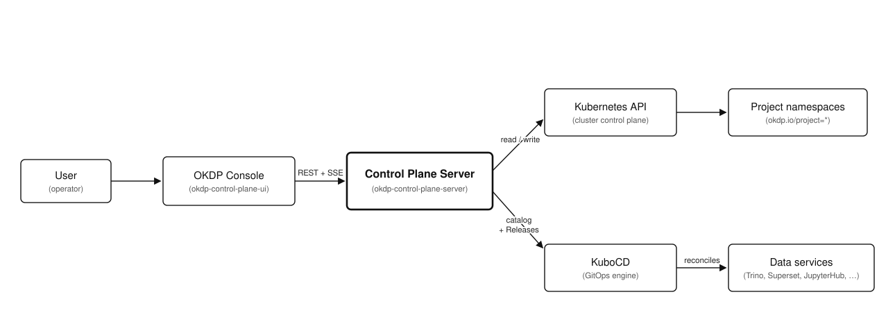

<p align="center">
  <a href="https://okdp.io">
    
  </a>
</p>

[](https://github.com/OKDP/okdp-control-plane-server/actions/workflows/release-please.yml)
[](http://www.apache.org/licenses/LICENSE-2.0)

# OKDP Control Plane Server

Docker image and Helm chart for the backend API of the OKDP web console
([okdp-control-plane-ui](https://github.com/OKDP/okdp-control-plane-ui)): a Go service that
manages OKDP projects and their data services on Kubernetes and exposes them to the console
over REST and Server-Sent Events (SSE).

---

## Why this project

The OKDP web console is a browser single-page application with no cluster credentials and
no server-side logic, so it cannot drive Kubernetes on its own. This repository is its
backend: an API that turns console actions into commits to the platform's deployments
Git repository (projects, service instances, connections, the service catalog), and reads
back what the cluster reports, streaming status, pods and metrics.

It is a first-party OKDP component, developed alongside the web console. Cluster credentials
and business logic stay on the server side, keeping the console a stateless browser client.

---

## What the project does

- **Docker image** `quay.io/okdp/images/okdp-control-plane-server`: runs the Go control-plane API
  server on a minimal Alpine base, listening on port `8093`.
- **Helm chart** (`chart/`): deploys the server in-cluster with its Git settings and the
  read-mostly RBAC it needs on the Kubernetes API.

The image and chart provide the backend for the OKDP web console, so the platform is
driven through the console instead of hand-written GitOps files. Both paths produce the
same files: a console deployment and a hand-written one are indistinguishable.

Project layout:

- `cmd/server`: entry point.
- `internal/api`: HTTP handlers and router.
- `internal/service`: business logic.
- `internal/gitops`: the deployments repository (go-git writer, layout, Flux rendering).
- `internal/repository`: cluster access (platform values, instance descriptors, GitOps engine status).
- `internal/config`: configuration loaded from environment variables.
- `chart/`: Helm chart.

---

## Architecture

<p align="center">
  
</p>

> **OKDP deployment context:** the server runs **in-cluster**. **Git is the only
> desired-state store**: the server never creates HelmReleases, Applications or workloads;
> it commits files to the deployments repository, and a GitOps engine (FluxCD or Argo CD)
> renders the same OKDP Helm charts with the same values layers. Observed state is read
> from the cluster: the instance descriptor ConfigMap each chart renders
> (`<release>-okdp`, label `okdp.io/instance`), the workloads (`app.kubernetes.io/instance`)
> and the engine's own objects for render/sync errors. There is no database; the local
> clone is a cache. Authentication (OIDC) is verified on every `/api` call; TLS is
> provided by the platform ingress.

What the server writes (relative to `GITOPS_PATH`):

```
platform/catalog.yaml                          # console service catalog
projects/<project>/project.yaml                # {name, description, …}: declares the project
projects/<project>/kustomization.yaml          # Flux only, generated: services + connection ConfigMaps
projects/<project>/connections/<name>.yaml     # external connection (credentials stay in a Secret)
projects/<project>/services/<instance>/instance.yaml
projects/<project>/services/<instance>/values.yaml  # the submitted parameters only
projects/<project>/services/<instance>/helmrelease.yaml   # Flux only, generated
projects/<project>/services/<instance>/kustomization.yaml # Flux only, generated
```

Projects are the `projects/<project>/project.yaml` files (the namespace is the project
name), whoever wrote them: a project declared by hand in Git is listed, served and edited
by the console like one the console created, and `/api/projects/stream` reports the
files as they change (read every few seconds). Creating a project from the console also
creates its Namespace (label `okdp.io/project`) so it can hold Secrets before any
deployment, and refuses a name that is already a Namespace without that label
(`kube-system`, …). Deleting a project removes `projects/<project>/` (the engine
uninstalls its releases), then the Namespace only if it carries the label; a namespace
the engine created is left, as when the directory is removed by hand. An update rewrites
`description` and keeps the other keys and the comments of the file.

Commits read `okdp: <action> <project>/<instance> by <user>`. The logged-in user is the
commit author; the configured GitOps identity (`GITOPS_AUTHOR_NAME` / `GITOPS_AUTHOR_EMAIL`)
is the committer, and the server names itself as co-author in a trailer:

```
Author:    Alice Martin <alice@example.com>
Committer: OKDP control plane <okdp-control-plane@okdp.io>

    okdp: deploy demo/trino by alice

    Co-Authored-By: okdp-control-plane-server v0.9.0 <okdp-control-plane@okdp.io>
```

The trailer names the program (the last element of the Go module path) and its version,
set at build time (`-ldflags "-X github.com/okdp/okdp-control-plane-server/internal/buildinfo.Version=<v>"`:
the image build passes the release version as the `VERSION` build argument, `make build`
passes `git describe`; `dev` otherwise), with the committer email. The author comes from
the access token: the `email` claim (Keycloak: the `email` client scope on the console
client) and the `name` claim (the `profile` scope; the user name when absent). Without an
email (the claim is missing or not an address, or authentication is disabled) the GitOps
identity authors the commit too, the user is named in the subject only, the message has
no trailer, and the server logs a warning once per user. CR, LF, `<` and `>` are stripped
from the name and email. Writes are serialised and
replayed on top of the new revision when someone else pushed in between. The generated
Flux files are byte-identical to what `scripts/render-flux.sh` of okdp-sandbox produces
(the format is specified in its `gitops/README.md`; the golden tests of
`internal/gitops` replay its fixtures and run the script itself). The reference
layout, and the script producing the same Flux files by hand, live in
[okdp-sandbox `gitops/`](https://github.com/OKDP/okdp-sandbox).

---

## Requirements

- Kubernetes cluster reconciled by [FluxCD](https://fluxcd.io) (helm-controller,
  source-controller, kustomize-controller) or [Argo CD](https://argo-cd.readthedocs.io),
  from a deployments Git repository laid out as above
- Write access to that repository (HTTPS token or SSH key)
- [Go](https://go.dev/) >= 1.25 (only to build the image or run the server locally)

Known-good baseline: chart and image `0.9.0` <!-- x-release-please-version -->
with Go `1.25`, on a Kind cluster. This is the version set validated by the maintainers.

### Toolchain tested

| Tool | Version |
|---|---|
| Go | `1.25` |
| Kind | `0.27.0` |
| kubectl | `1.32.2` |

> The server does not need the `helm` or `kubectl` binaries to run: it communicates with the
> Kubernetes API through the client-go library. Helm (>= 3) is needed only to deploy the
> chart, and `kubectl` to inspect the cluster.

---

## Installation

The server runs in-cluster, next to a GitOps engine reconciling the deployments
repository. Give it write access through a Secret using the Flux `GitRepository` keys:

```sh
kubectl create secret generic okdp-gitops-credentials -n okdp-system \
  --from-literal=username=okdp-console --from-literal=password=<token>
# or, over SSH: --from-file=identity=./id_ed25519 --from-file=known_hosts=./known_hosts
```

The platform values (`global.okdp`) are read from the ConfigMap `okdp-platform-values`
(key `values.yaml`) that Flux generates in `okdp-releases`, or from
`platform/platform-values.yaml` in Git when there is none (Argo CD).

Install the chart from the OKDP registry:

<!-- x-release-please-start-version -->
```sh
helm install okdp-control-plane-server oci://quay.io/okdp/charts/okdp-control-plane-server --version 0.9.0 \
  -n okdp-system --create-namespace \
  --set gitops.repoURL=https://git.example.com/okdp/deployments.git \
  --set gitops.credentialsSecret=okdp-gitops-credentials \
  --set gitops.engine=flux
```
<!-- x-release-please-end -->

> This chart name is published on Quay once the rename lands upstream. Until
> then, install from `chart/` in this checkout.

Once the pod is `Running`, reach the API through a port-forward:

```sh
kubectl port-forward -n okdp-system svc/okdp-control-plane-server 8093:8093
curl -s http://localhost:8093/health
# {"status":"ok"}
```

The Swagger UI is then available at `http://localhost:8093/swagger/index.html`.

---

## Cleanup

Remove the Helm release, and the namespace if it was created only for this install:

```sh
helm uninstall okdp-control-plane-server -n okdp-system
kubectl delete namespace okdp-system
```

---

## Development

### Run the server locally

Both options require a `KUBECONFIG` pointing at a Kubernetes cluster (the server
connects to the Kubernetes API at startup) and a deployments repository: any Git URL
works, a local bare repository included (`git init --bare /tmp/deployments.git`).

**On your machine.** Install Go and the development tools (`kubectl`, `air`,
`swag`, `golangci-lint`, `delve`), then:

```sh
export KUBECONFIG=<path-to-your-kubeconfig>
export GITOPS_REPO_URL=file:///tmp/deployments.git
make dev                 # hot-reload on :8093
# or, without hot-reload:
go run ./cmd/server
```

**In the devcontainer.** Only Docker is required: open the repository and select "Reopen
in Container" (or run `devcontainer up`). The container ships the full toolchain,
publishes port 8093 and syncs a container-reachable copy of the host kubeconfig at
startup. Then run `make dev`.

### Build, test and lint

No cluster is required:

```sh
make build     # compile the binary to bin/server
make test      # run the tests
make lint      # run golangci-lint
make swagger   # regenerate the Swagger documentation
```

Run `make help` for the full list of targets.

---

## Configuration

The server is configured through environment variables, rendered by the chart from
its `configuration:` values (see [`chart/values.yaml`](chart/values.yaml)).

| Parameter | Description | Default | Required |
|-----------|-------------|---------|:--------:|
| `PORT` | HTTP port the server listens on | `8093` | No |
| `PLATFORM_NAMESPACE` | Namespace where the OKDP platform runs | `okdp-system` | No |
| `ALLOWED_ORIGINS` | Single CORS origin, set verbatim in `Access-Control-Allow-Origin` (the console URL) | `http://localhost:4200` | No |
| `LOG_LEVEL` | Log verbosity (`debug`, `info`, `warn`, `error`) | `info` | No |
| `GIN_MODE` | HTTP framework mode (`debug` prints every route) | `release` | No |
| `GITOPS_REPO_URL` | Deployments repository (`https://…`, `ssh://…`, `git@host:path`, `file://…`) | | **Yes** |
| `GITOPS_BRANCH` | Branch holding the desired state | `main` | No |
| `GITOPS_PATH` | Directory of the repository holding the layout | repository root | No |
| `GITOPS_CREDENTIALS_DIR` | Mounted credentials Secret (`username`/`password`, `bearerToken`, or `identity`/`known_hosts`) | `/etc/okdp/gitops-credentials` | No |
| `GITOPS_SSH_INSECURE_IGNORE_HOST_KEY` | Accept any SSH host key (sandboxes only) | `false` | No |
| `GITOPS_AUTHOR_NAME` / `GITOPS_AUTHOR_EMAIL` | Commit committer (and author when the user has no email; the logged-in user authors the commit otherwise) | `OKDP control plane` / `okdp-control-plane@okdp.io` | No |
| `GITOPS_CLONE_DIR` | Local clone, a cache (empty: in memory) | in memory | No |
| `GITOPS_ENGINE` | `flux` or `argocd`: whose objects carry render/sync errors | `flux` | No |
| `GITOPS_RELEASES_NAMESPACE` | Flux HelmReleases and values ConfigMaps, `okdp-platform-values` included | `okdp-releases` | No |
| `ARGOCD_NAMESPACE` | Argo CD Applications | `argocd` | No |
| `INSECURE_OCI_REGISTRIES` | Registry hosts reached over plain HTTP to read chart schemas (sandboxes); also the only registries whose anonymous-token realm may be plain HTTP | | No |
| `KEYCLOAK_CLIENT_ID` | Keycloak service-account client of the platform realm (chart: `keycloak.credentialsSecret`, key `client_id`) | `okdp-control-plane` | No |
| `KEYCLOAK_CLIENT_SECRET` | Its secret (chart: `keycloak.credentialsSecret`, key `client_secret`). Unset: user and group management is off | | No |
| `KEYCLOAK_URL` / `KEYCLOAK_REALM` | Keycloak base URL and realm of the Admin API | from the platform OIDC issuer `<url>/realms/<realm>` | No |
| `KEYCLOAK_TLS_INSECURE` | Skip the Keycloak certificate check (sandboxes only) | `false` | No |
| `EXCLUDED_SIDECAR_PREFIXES` | Container name prefixes excluded from pod/metrics views (comma-separated) | `istio-proxy,istio-init,dynatrace-,linkerd-proxy,envoy,vault-agent` | No |

Users and groups (`/api/v1/identity`, the console's Identity pages) are managed in the
platform Keycloak realm through its Admin REST API. The client named by `KEYCLOAK_CLIENT_ID`
must be confidential, with service accounts enabled, and its service account must hold the
roles `view-users`, `query-users`, `manage-users` and `query-groups` of the realm's
management client: `realm-management` in a regular realm, but `master-realm` in the
`master` realm (there, `realm-management` does not exist; each realm `<r>` has a
`<r>-realm` client in `master`).
Without `KEYCLOAK_CLIENT_SECRET` the identity routes answer `501` and `/api/capabilities`
reports `identity.userManagement: false`. The `comment` and `uid` of a user are Keycloak
user attributes: on Keycloak 24+ the realm user profile must allow them (unmanaged
attributes enabled, or both attributes declared), otherwise Keycloak drops them.

> For the full chart values (image, service, resources, RBAC), see
> [`chart/values.yaml`](chart/values.yaml).

---

## Images

Images are published to [`quay.io/okdp`](https://quay.io/organization/okdp).

| Image | Tag format | Example |
|-------|-----------|---------|
<!-- x-release-please-start-version -->
| `quay.io/okdp/images/okdp-control-plane-server` | `<version>` (matches the chart `appVersion`) | `quay.io/okdp/images/okdp-control-plane-server:0.9.0` |
<!-- x-release-please-end -->

> See the [available tags on quay.io](https://quay.io/repository/okdp/images/okdp-control-plane-server?tab=tags) for all published versions.

---

## Troubleshooting

### The pod restarts in a loop (`CrashLoopBackOff`)

**Cause:** the server builds its Kubernetes client at startup and exits if it cannot.
The logs show `Failed to initialize Kubernetes client: failed to get kubernetes config
(tried in-cluster and local)`. In-cluster this means the ServiceAccount or its RBAC is
missing; for a local run it means `KUBECONFIG` is unset or invalid.

**Fix:** in-cluster, make sure the chart's ServiceAccount and RBAC are applied; locally,
point `KUBECONFIG` at a valid config. Then check the logs and permissions:

```sh
kubectl logs -n okdp-system -l app.kubernetes.io/name=okdp-control-plane-server
kubectl auth can-i get namespaces
```

### API calls fail only in the browser (CORS)

**Cause:** the server returns `Access-Control-Allow-Origin` set verbatim to
`ALLOWED_ORIGINS` (default `http://localhost:4200`). When that value does not match the
origin the console is served from, the browser blocks the response and its console shows
`No 'Access-Control-Allow-Origin' header`. The same requests still work with `curl`.

**Fix:** set `ALLOWED_ORIGINS` to the exact console origin and redeploy.

### The service catalog is empty, or `GET /api/platform-services` returns `500`

**Cause:** the catalog is `platform/catalog.yaml` in the deployments repository. A `500`
means the repository cannot be reached (URL, branch or credentials; the log names the
fetch error). An empty but successful catalog means the file is missing or has no
`categories`.

**Fix:** check the `GITOPS_*` settings and the credentials Secret, and that the file
exists on `GITOPS_BRANCH` under `GITOPS_PATH`.

### A deployed service stays `Pending`

**Cause:** the instance is committed, but the GitOps engine has not produced its
HelmRelease (`okdp-releases/<project>-<instance>`) or Application (`<project>-<instance>`)
yet. Either it has not reconciled the new revision, or it does not watch that path.

**Fix:** check the engine (`flux get kustomizations`, or the ApplicationSet in Argo CD),
and that `GITOPS_ENGINE` names the engine actually in use.

---

## Contributing & License

Contributions follow the [OKDP contribution guide](https://github.com/OKDP/.github/blob/main/CONTRIBUTING.md). Released under the [Apache License 2.0](LICENSE).

---

**Built 🚀 for the OKDP Community**
<a href="https://okdp.io">
  
</a>
